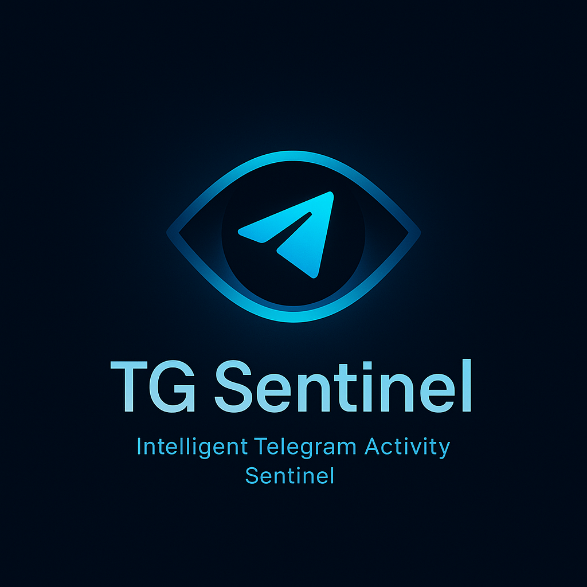
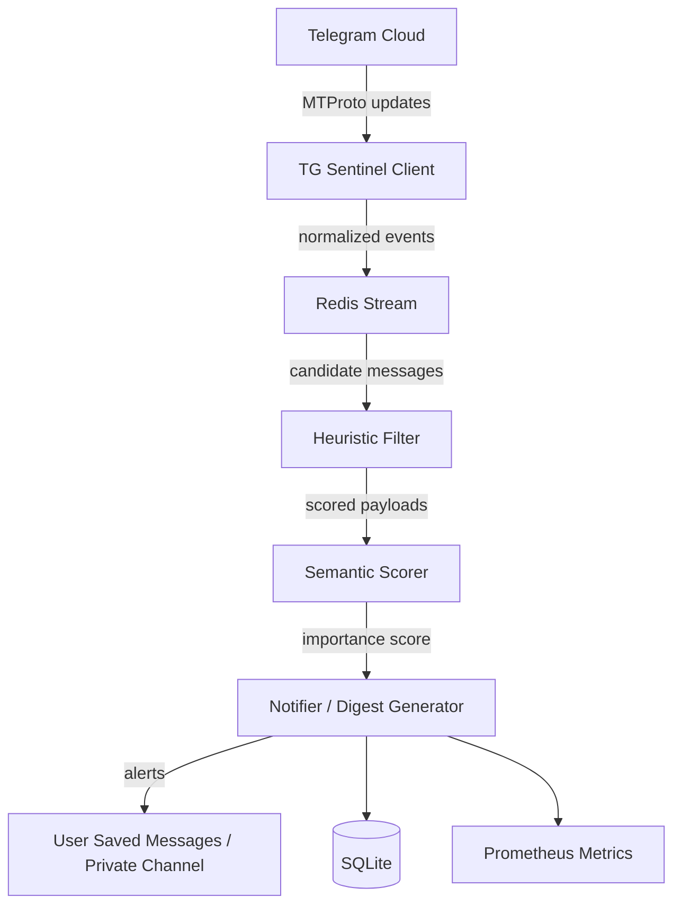

# TG Sentinel - Telegram Importance Filter & Alerting System

<div align="center">
  
  <br />
</div>

[](https://www.python.org/downloads/)
[](https://www.docker.com/)

---

## 🚀 Overview

Modern Telegram power-users often belong to dozens of channels and groups, most of which are muted due to noise.

TG Sentinel automatically monitors them for you, applies intelligent filtering and semantic scoring, and delivers concise alerts or daily digests containing only high-value messages.

TG Sentinel runs locally or on your own server — your data never leaves your environment.

---

## 🧩 Core Features

| Category                        | Description                                                                                                                                            |
| ------------------------------- | ------------------------------------------------------------------------------------------------------------------------------------------------------ |
| **User-client ingestion**       | Connects directly to Telegram via **MTProto (user session)** using [Telethon](https://docs.telethon.dev) or [TDLib]. No bots or group invites needed.  |
| **Global listener**             | Subscribes to all dialogs, channels, and groups you belong to (except secret chats).                                                                   |
| **Two-stage importance engine** | Stage A: fast heuristics (mentions, VIPs, keywords, reactions, replies, pins). Stage B: semantic scoring using embeddings or local LLM classification. |
| **Multi-channel rules**         | YAML configuration per chat: keywords, VIP senders, reaction thresholds, rate limits.                                                                  |
| **Digest & alerts**             | Sends important posts directly to your "Saved Messages" or to a private "Important 🔔" channel. Hourly/daily digests group the highlights.             |
| **Feedback loop**               | React 👍/👎 on alerts; TG Sentinel learns from your votes and adjusts thresholds automatically.                                                        |
| **Privacy-first**               | Runs entirely under your control. No external APIs required. Message contents are analyzed locally.                                                    |
| **Resilient & observable**      | Durable ingestion via Redis Streams; Prometheus metrics; graceful reconnection; gap recovery.                                                          |
| **Minimal footprint**           | ~100 MB RAM; runs on any always-on VPS, mini-PC, or Docker host.                                                                                       |

---

## 🏗️ Architecture



### Components

1. **Telegram Client**

   - Built with Telethon for a persistent `.session` and resilient reconnects.
   - Streams `NewMessage` events from all authorized chats and normalizes metadata.
   - Prepares payloads with chat, sender, reply, and reaction context.

2. **Redis Stream**

   - Append-only queue that decouples ingestion and analysis stages.
   - Provides at-least-once delivery semantics and natural backpressure.

3. **Heuristic Filter**

   - Applies fast rule checks for mentions, VIP senders, surge thresholds, and keyword hits.
   - Tags candidate events with rule-based reasons before semantic scoring.

4. **Semantic Scorer**

   - Embedding classifier (e.g., `all-MiniLM-L6-v2`) comparing messages to interest profiles.
   - Computes cosine similarity, clamps/normalizes scores, and enriches metadata.

5. **Notifier & Digest Generator**

   - Sends immediate alerts plus hourly/daily digests with deduplication.
   - Enforces per-channel throttling and delivery fallbacks.

6. **Metadata Store**

   - SQLite database persisting message IDs, scores, and alert history.
   - Powers replay tooling, dashboards, and audit trails.

7. **Metrics & Observability**
   - Exposes Prometheus metrics for queue depth, latency, and alert throughput.
   - Surfaces health probes for deployment monitoring.

## 🚀 Quick Start

1. **Get Telegram API Credentials**• Computes cosine similarity between message vector and user “interest profiles” (topics defined in config/interests.yml).

• Optional local embedding model (e.g., all-MiniLM-L6-v2, bge-small-en) or quantized ggml model.

- Visit <https://my.telegram.org/auth>• Fallback to API call only if local model abstains.

- Log in with your phone number

- Go to "API development tools"5️⃣ Notifier & Digest Generator

- Create a new application• Sends:

- Copy your `api_id` (7-8 digits) and `api_hash` (32-character hex)• Instant alerts (per-message DM to yourself)

• Hourly or daily digest (Top-N by score)

1. **Configure Environment**

### Environment Variables

All runtime settings can be supplied via environment variables:

| Variable               | Default                           | Description                                                        |
| ---------------------- | --------------------------------- | ------------------------------------------------------------------ |
| `TG_API_ID`            | _(required)_                      | Telegram API ID from <https://my.telegram.org>                     |
| `TG_API_HASH`          | _(required)_                      | Telegram API hash from <https://my.telegram.org>                   |
| `UI_SECRET_KEY`        | _(required)_                      | Flask secret key for session security (32+ random bytes)           |
| `ALERT_MODE`           | `dm`                              | Alert destination: `dm`, `channel`, or `both`                      |
| `ALERT_CHANNEL`        | `""`                              | Target channel/bot username (for channel/`both` modes)             |
| `HOURLY_DIGEST`        | `true`                            | Enable hourly digest dispatch                                      |
| `DAILY_DIGEST`         | `true`                            | Enable daily digest dispatch                                       |
| `DIGEST_TOP_N`         | `10`                              | Number of top messages included in each digest                     |
| `EMBEDDINGS_MODEL`     | `all-MiniLM-L6-v2`                | Sentence-transformer model for semantic scoring (empty to disable) |
| `SIMILARITY_THRESHOLD` | `0.42`                            | Semantic similarity threshold (0–1)                                |
| `REDIS_HOST`           | `redis`                           | Redis hostname used by background workers                          |
| `REDIS_PORT`           | `6379`                            | Redis port                                                         |
| `DB_URI`               | `sqlite:////app/data/sentinel.db` | Database connection string                                         |

> **Security Note**: Generate `UI_SECRET_KEY` using: `python -c "import secrets; print(secrets.token_hex(32))"`

### YAML Configuration

`config/tgsentinel.yml` ships with sane defaults. A representative configuration:

```yaml
telegram:
session: "data/tgsentinel.session"

alerts:
mode: "dm"          # dm | channel | both
target_channel: ""

digest:
hourly: true
daily: true
top_n: 10

channels:
- id: -100123456789
   name: "Dev Channel"
   vip_senders:
      - 111111
      - 222222
   keywords:
      - "release"
      - "security"
      - "CVE"
   reaction_threshold: 8
   reply_threshold: 10
   rate_limit_per_hour: 5

interests:
- "topic I care about"
- "another important subject"
```

### Examples

#### First Run (interactive login)

```bash
docker compose build
docker compose run --rm -it sentinel python -m tgsentinel.main
```

During the first run you will be prompted for your phone number, login code, and (if applicable) 2FA password. Successful authentication creates `data/tgsentinel.session` for future sessions.

#### Start services

```bash
docker compose up -d
docker compose logs -f sentinel
```

#### Run tests

```bash
make test
# or
python tools/run_tests.py
```

1. **Start Services**

```bash
EMBEDDINGS_MODEL=all-MiniLM-L6-v2

   SIMILARITY_THRESHOLD=0.42

   docker compose up -d

   docker compose logs -f sentinel

```

Edit `config/tgsentinel.yml` to add monitored channels:

---

````yaml

## 🔧 Configuration   channels:

  - id: -100123456789

### Environment Variables       name: "My Channel"

    vip_senders: [111111, 222222]

All settings can be overridden via environment variables:       keywords: ["important", "urgent", "security"]

    reaction_threshold: 5

| Variable               | Default                           | Description                                        |       reply_threshold: 3

| ---------------------- | --------------------------------- | -------------------------------------------------- |

| `TG_API_ID`            | _(required)_                      | Telegram API ID from my.telegram.org               |   interests:

| `TG_API_HASH`          | _(required)_                      | Telegram API hash                                  |     - "topic I care about"

| `ALERT_MODE`           | `dm`                              | Alert destination: `dm`, `channel`, or `both`      |     - "another important subject"

| `ALERT_CHANNEL`        | `""`                              | Target channel/bot username (e.g., `@kit_red_bot`) |   ```

| `HOURLY_DIGEST`        | `true`                            | Enable hourly digest                               |

| `DAILY_DIGEST`         | `true`                            | Enable daily digest                                |4. **First Run (Interactive Login)**

| `DIGEST_TOP_N`         | `10`                              | Number of top messages in digest                   |

| `EMBEDDINGS_MODEL`     | `all-MiniLM-L6-v2`                | Sentence transformer model (empty to disable)      |   ```bash

| `SIMILARITY_THRESHOLD` | `0.42`                            | Semantic similarity threshold (0-1)                |   docker compose build

| `REDIS_HOST`           | `redis`                           | Redis hostname                                     |   docker compose run --rm -it sentinel python -m tgsentinel.main

| `REDIS_PORT`           | `6379`                            | Redis port                                         |   ```

| `DB_URI`               | `sqlite:////app/data/sentinel.db` | Database connection string                         |

You'll be prompted for:

### YAML Configuration (`config/tgsentinel.yml`)

- Phone number (with country code, e.g., +1234567890)

```yaml   - Login code (sent via SMS or Telegram)

telegram:   - 2FA password (if enabled)

session: "data/tgsentinel.session"

This creates `data/tgsentinel.session` for future runs.

alerts:

mode: "dm"  # dm | channel | both5. **Start Services**

target_channel: ""   ```bash

digest:   docker compose up -d

 hourly: true   docker compose logs -f sentinel

 daily: true   ```

 top_n: 10

### Testing

channels:

- id: -100123456789Run the test suite:

 name: "Dev Channel"

 vip_senders: [111111, 222222]```bash

 keywords: ["release", "security", "CVE"]# Using make

 reaction_threshold: 8make test

 reply_threshold: 10

 rate_limit_per_hour: 5# Or directly

python tools/run_tests.py

interests:

- "software development"# With coverage

- "security advisories"make test-cov

````

---### Development

## 🧪 TestingFormat code (like Prettier for Python)

Run the test suite:```bash

make format

`bash`

## Using make

make testAvailable commands:

## Or directly

`````bash

python tools/run_tests.pymake help # Show all commands

make format # Format all Python files

# With coveragemake format-check # Check formatting (CI mode)

pytest --cov=src/tgsentinel --cov-report=htmlmake test # Run tests

````make lint              # Run type checking

make clean             # Clean generated files

**Test the digest feature:**make docker-build      # Build Docker image

make docker-up         # Start services

```bashmake docker-down       # Stop services

# Insert sample messagesmake docker-logs       # Follow logs

docker compose exec sentinel python /app/data/test_digest.py```


# Trigger digest manually---

docker compose run --rm -e TEST_DIGEST=true sentinel python -m tgsentinel.main

```�🔧 Configuration


---### Environment Variables


## 🛠️ DevelopmentAll settings can be overridden via environment variables:


### Code Formatting| Variable               | Default                           | Description                                        |

| ---------------------- | --------------------------------- | -------------------------------------------------- |

Format all Python files (like Prettier):| `TG_API_ID`            | _(required)_                      | Telegram API ID from my.telegram.org               |

| `TG_API_HASH`          | _(required)_                      | Telegram API hash                                  |

```bash| `ALERT_MODE`           | `dm`                              | Alert destination: `dm`, `channel`, or `both`      |

make format| `ALERT_CHANNEL`        | `""`                              | Target channel/bot username (e.g., `@kit_red_bot`) |

```| `HOURLY_DIGEST`        | `true`                            | Enable hourly digest                               |

| `DAILY_DIGEST`         | `true`                            | Enable daily digest                                |

This runs `black` and `isort` on all source files.| `DIGEST_TOP_N`         | `10`                              | Number of top messages in digest                   |

| `EMBEDDINGS_MODEL`     | `all-MiniLM-L6-v2`                | Sentence transformer model (empty to disable)      |

### Available Make Commands| `SIMILARITY_THRESHOLD` | `0.42`                            | Semantic similarity threshold (0-1)                |

| `REDIS_HOST`           | `redis`                           | Redis hostname                                     |

```bash| `REDIS_PORT`           | `6379`                            | Redis port                                         |

make help              # Show all commands| `DB_URI`               | `sqlite:////app/data/sentinel.db` | Database connection string                         |

make format            # Format all Python files

make format-check      # Check formatting (CI mode)### YAML Configuration

make test              # Run tests

make test-cov          # Run tests with coverage`config/tgsentinel.yml`:

make lint              # Run type checking

make clean             # Clean generated filestelegram:

make docker-build      # Build Docker imageapi_id: 123456

make docker-up         # Start servicesapi_hash: "your_api_hash_here"

make docker-down       # Stop servicessession: "tgsentinel.session"

make docker-logs       # Follow logs

make docker-test       # Run tests in containerredis:

```host: localhost

port: 6379

### Project Structurestream: "tgsentinel:messages"


```textdatabase:

TGSentinel/uri: "sqlite:///data/sentinel.db"

├── src/tgsentinel/           # Main application code

│   ├── client.py             # Telegram client & ingestionalerts:

│   ├── worker.py             # Redis stream processormode: "dm" # dm | channel | both

│   ├── heuristics.py         # Rule-based filteringdigest_hourly: true

│   ├── semantic.py           # Embedding-based scoringdigest_daily: true

│   ├── digest.py             # Digest generator

│   ├── notifier.py           # Alert senderchannels:

│   ├── store.py              # SQLite database

│   ├── config.py             # Configuration loader- id: -100123456789

│   └── main.py               # Entry point  name: "Algorand Dev"

├── tests/                    # Test suite (110 tests)  vip_senders: [12345, 67890]

├── config/                   # Configuration files  keywords: ["release", "security", "CVE", "go-algorand"]

├── data/                     # Runtime data (sessions, DB)  reaction_threshold: 8

├── docker/                   # Docker build files  reply_threshold: 10

├── tools/                    # Development scripts  rate_limit_per_hour: 5

│   ├── format.sh             # Code formatter

│   └── run_tests.py          # Test runnerinterests:

├── Makefile                  # Development commands

├── pyproject.toml            # Python project config- "algorand core development"

├── pytest.ini                # Test configuration- "blockchain security advisories"

└── docker-compose.yml        # Service orchestration- "governance proposals"

`````

⸻

---

🐍 Quick Start (Docker Compose)

## 🔒 Privacy & Security

````yaml

- ✅ Uses your own Telegram account session; no bots involvedversion: "3.9"

- ✅ Does not access secret chats (not possible via API)services:

- ✅ All analysis is local—no message content sent to third parties  redis:

- ✅ Session file encrypted by Telethon    image: redis:7

- ✅ Optionally run behind a VPN for IP masking    restart: always

- ⚠️ Keep your `.session` file secure—it grants full account access  sentinel:

    image: ghcr.io/youruser/tgsentinel:latest

---    environment:

      - TG_API_ID=${TG_API_ID}

## ⚙️ Operational Guidelines      - TG_API_HASH=${TG_API_HASH}

    volumes:

| Concern             | Best Practice                                                                 |      - ./config:/app/config

| ------------------- | ----------------------------------------------------------------------------- |      - ./data:/app/data

| **Rate limits**     | Read-only operation; avoid sending >20 alerts/min to prevent spam detection |    depends_on:

| **Session**         | Keep one `.session` file per account; reuse on restarts                     |      - redis

| **Crash safety**    | Redis Streams ensure no message loss                                         |    restart: always

| **Resource use**    | CPU < 5%, RAM ≈ 100–150 MB on typical setups                                |```

| **Scaling**         | Horizontal: multiple workers consuming from Redis stream groups              |

1. Create a new Telegram API app at my.telegram.org.

---2. Fill in your api_id and api_hash in config/tgsentinel.yml.

3. Run docker compose up -d.

## 🧠 Importance Scoring4. On first run, TG Sentinel will open an interactive login to obtain your session.

5. Start receiving intelligent alerts within minutes.

### Two-Stage Pipeline

⸻

| Stage | Technique                                   | Cost  | Purpose                   |

| ----- | ------------------------------------------- | ----- | ------------------------- |🧠 Importance Model (Summary)

| A     | Regex/keyword match, VIP sender, mentions   | O(1)  | Immediate signal detection |

| B     | Text embeddings (cosine similarity)         | O(n×d)| Semantic relevance         |Stage Technique Cost Purpose

A Regex/keyword match, VIP sender, mentions, reaction surge O(1) Immediate signal detection

**Score calculation:**B Text embeddings (cosine > τ) vs. interest vectors O(n × d) Semantic relevance

C Optional LLM summarization & classification High Rare fallback for long posts

1. **Heuristic score** (0-3.0):

   - Mention: +1.0TG Sentinel learns from feedback. React with 👍 on relevant alerts, 👎 on false positives; it re-weights feature coefficients weekly.

   - VIP sender: +0.8

   - Reaction threshold met: +0.4⸻

   - Reply threshold met: +0.4

   - Keyword match: +0.6🔒 Privacy & Security Notes

• Uses your own Telegram account session; no bots involved.

2. **Semantic score** (0-1.0):• Does not access secret chats (not possible via API).

   - Cosine similarity between message embedding and interest profile• All analysis is local. No message content is sent to third-party services.

   - Added to heuristic score if > `SIMILARITY_THRESHOLD`• Optionally run behind a VPN for IP masking (MTProxy not required).

• Data retention: message content purged after 7–14 days; metadata kept for learning.

3. **Final decision**:

   - Alert if heuristic OR semantic threshold exceeded⸻

   - Store score in SQLite for digest ranking

⚙️ Operational Guidelines

---

Concern Best Practice

## 📈 RoadmapRate limits TG Sentinel is read-only; avoid sending >20 msgs/min to self to prevent spam flag.

Session persistence Keep one .session file per account; reuse on restarts.

- [ ] Web UI for threshold tuning & feedback visualizationCrash safety Redis Streams + checkpointing ensure no message loss.

- [ ] Multi-account supportScaling Horizontal: multiple semantic workers consuming from stream groups.

- [ ] Fine-tuning via user-tagged dataResource use CPU < 5%, RAM ≈ 100–150 MB on typical setups.

- [ ] Webhook integration (Discord, Slack, etc.)

- [ ] Message summarization for long posts⸻


---🧪 Example Telethon Skeleton (Simplified)


## 🧰 Tech Stackfrom telethon import TelegramClient, events

import re

| Layer       | Technology                                       |

| ----------- | ------------------------------------------------ |API_ID = ...

| Ingestion   | Python 3.11 + Telethon                           |API_HASH = ...

| Queue       | Redis 7 Streams                                  |SESSION = "tgsentinel.session"

| Data store  | SQLite                                           |client = TelegramClient(SESSION, API_ID, API_HASH)

| Classifier  | sentence-transformers (all-MiniLM-L6-v2)        |

| Testing     | pytest, pytest-asyncio, pytest-mock (110 tests) |IMPORTANT = re.compile(r"(algorand|security|release|CVE)", re.I)

| Deployment  | Docker / Docker Compose                          |VIP = {12345, 67890}


---def important(m):

return (

## 📜 Licensem.mentioned or

m.sender_id in VIP or

MIT License © 2025 [redoracle](https://github.com/redoracle)(m.message and IMPORTANT.search(m.message))

)

Use at your own risk; this software interacts with the Telegram API via your own user session.

@client.on(events.NewMessage())

---async def handler(event):

if important(event.message):

## 🧭 Philosophytext = (event.message.message or "").strip()

await client.send_message("me", f"🔔 {event.chat.title}: {text[:200]}")

> "Signal over noise."

client.start()

TG Sentinel is designed for professionals, developers, and analysts who need to stay informed without drowning in chatter.client.run_until_disconnected()

It's not another notification flood—it's a sentinel standing guard over your attention.

⸻

---

📈 Roadmap

## 🤝 Contributing• Web UI for threshold tuning & feedback visualization

• On-device summarization model integration

Contributions welcome! Please:• Multi-account support

• Distributed classifier pool

1. Fork the repository• Fine-tuning via user-tagged data

2. Create a feature branch (`git checkout -b feature/amazing-feature`)

3. Run tests (`make test`)⸻

4. Format code (`make format`)

5. Commit changes (`git commit -m 'Add amazing feature'`)🧰 Tech Stack

6. Push to branch (`git push origin feature/amazing-feature`)

7. Open a Pull RequestLayer Technology

Ingestion Python 3 + Telethon / TDLib

---Queue Redis 7 Streams

Data store SQLite

## 📞 SupportClassifier Local embeddings + optional LLM

Metrics Prometheus + Grafana

- **Issues**: <https://github.com/redoracle/TGSentinel/issues>Deployment Docker / Docker Compose

- **Discussions**: <https://github.com/redoracle/TGSentinel/discussions>

⸻

---

📜 License

**Built with ❤️ for Telegram power users**

MIT License © 2025 Michael — TG Sentinel
Use at your own risk; this software interacts with the Telegram API via your own user session.

⸻

🧭 Philosophy

“Signal over noise.”
TG Sentinel is designed for professionals, developers, and analysts who need to stay informed without drowning in chatter.
It’s not another notification flood — it’s a sentinel standing guard over your attention.

## How to run

```bash

source .venv/bin/activate  # optional, if using virtualenv
cp .env.sample .env
# edit .env with your API credentials
# optionally adjust config/tgsentinel.yml

docker compose build
docker compose up -d
# first start will prompt Telegram login in the container logs:
docker compose logs -f sentinel
````
