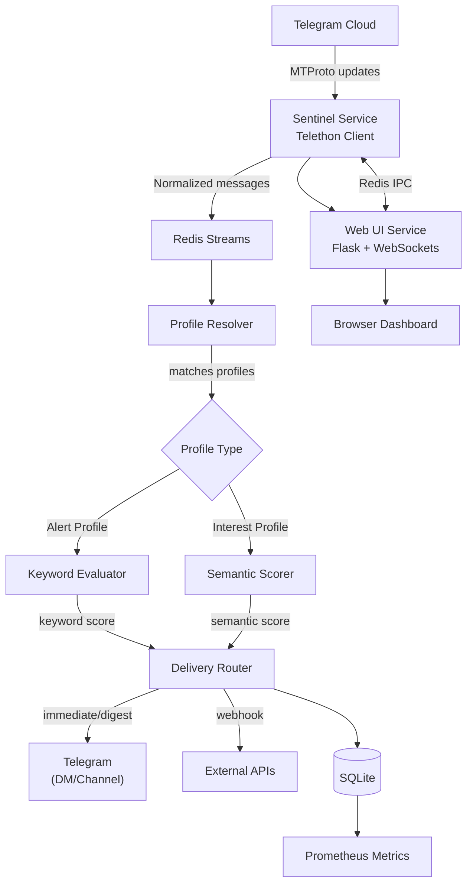

# 🛰️ TG Sentinel

> **Intelligent Telegram Activity Sentinel**
>
> TG Sentinel is a self-hosted, privacy-preserving Telegram companion that listens to all messages across your channels, groups, and private chats (using your own user session, not a bot), and alerts you only when something truly important happens.
>
> Its goal is simple: **reduce noise, preserve signal.**

---

## 🚀 Overview

Modern Telegram power-users often belong to dozens of channels and groups, most of which are muted due to noise.  
TG Sentinel automatically monitors them for you, applies intelligent filtering and semantic scoring, and delivers concise alerts or daily digests containing only high-value messages.

TG Sentinel runs locally or on your own server — your data never leaves your environment.

---

## 🧩 Core Features

| Category                        | Description                                                                                                                                      |
| ------------------------------- | ------------------------------------------------------------------------------------------------------------------------------------------------ |
| **User-client ingestion**       | Connects directly to Telegram via **MTProto (user session)** using [Telethon](https://docs.telethon.dev). No bots or group invites needed.       |
| **Global listener**             | Subscribes to all dialogs, channels, and groups you belong to (except secret chats).                                                             |
| **Two-stage importance engine** | Stage A: fast heuristics (mentions, VIPs, keywords, reactions, replies, pins). Stage B: semantic scoring using embeddings for interest profiles. |
| **Unified profiles system**     | Alert profiles (keyword-based) and Interest profiles (semantic-based) managed from a single web UI with per-profile digest schedules.            |
| **Digest & alerts**             | Per-profile delivery: immediate DMs, scheduled hourly/daily digests, or webhook delivery. Flexible top-N and min_score thresholds.               |
| **Webhook integration**         | Configure outbound webhooks with Fernet encryption, template customization, and per-profile routing for external integrations.                   |
| **Web UI dashboard**            | Modern Flask-based interface for monitoring alerts, managing profiles, configuring webhooks, viewing analytics, and system health.               |
| **Privacy-first**               | Runs entirely under your control. No external APIs required. Message contents are analyzed locally with optional embeddings.                     |
| **Resilient & observable**      | Durable ingestion via Redis Streams; Prometheus metrics; graceful reconnection; structured JSON logging; Docker health checks.                   |
| **Dual-service architecture**   | Sentinel service (Telethon + worker) and UI service (Flask + WebSockets) communicate via Redis IPC for clean separation and scalability.         |

---

## 🏗️ Architecture



Components

1️⃣ Sentinel Service (Telegram Client)
• Based on Telethon (Python) with asyncio event loop.
• Maintains a persistent session (.session file) with exclusive ownership.
• Streams NewMessage events from all accessible chats in real-time.
• Performs normalization: chat ID, sender, timestamp, text, entities, reply/reaction counts.
• **Single-Owner Pattern**: Only the sentinel container owns and writes to the session SQLite database.
• Exposes Flask API (port 8080) for UI communication and health checks.
• Handles Redis-based IPC for authentication and Telegram data access delegation.

2️⃣ Redis Stream (Message Bus)
• Lightweight, append-only queue between ingestion and analysis stages.
• Ensures at-least-once delivery, buffering, and natural backpressure.

3️⃣ Profile Resolver & Evaluators
• **Profile Resolver**: Matches incoming messages against all enabled profiles (alert + interest).
• **Alert Evaluator**: Fast keyword-based scoring for alert profiles.
• Checks: Mentions, VIP senders, urgency/security/action keywords, admin/pinned posts
• Configurable keyword weights and minimum score thresholds
• Per-profile delivery recommendations (immediate DM, digest, webhook)
• **Interest Evaluator**: Semantic scoring using sentence transformers.
• Computes embeddings for message and positive/negative samples
• Cosine similarity scoring with configurable thresholds (default 0.55)
• Negative sample weighting to reduce false positives
• Both evaluators produce scored results with matched profile IDs for delivery routing.

4️⃣ Delivery Router & Digest Scheduler
• **Per-profile delivery modes**: immediate DM, scheduled digest (hourly/daily), webhook, or hybrid (both).
• **Digest Scheduler**: Multi-schedule support per profile with configurable:
• Schedule type: none (immediate), hourly, daily (with specific hour)
• Min score threshold and top-N message limits
• Target channel (DM or specific chat)
• **Webhook Delivery**: Fernet-encrypted payloads with customizable templates and retry logic.
• **Deduplication**: Content hash-based to prevent duplicate alerts within rolling windows.
• **Rate Limiting**: Per-channel and per-profile limits enforced via Redis.

5️⃣ Persistence Layer (SQLite)
• **sentinel.db**: Main application database
• Message metadata: chat_id, message_id, content_hash, score, matched_profiles
• Alert history: alerted timestamp, delivery mode, profile associations
• Digest tracking: digest_schedule field, digest_processed flag
• Sender information: sender_id, sender_name for analytics
• Trigger annotations: JSON field with keyword/semantic match details
• **Retention**: Configurable cleanup of old messages (default: processed digests + 7 days)
• **Indexes**: Optimized for alert queries, digest selection, and analytics aggregations
• **Schema migrations**: Idempotent column additions via \_add_column_if_missing on startup

6️⃣ Web UI Service
• **Flask application** (port 5000) with Socket.IO for real-time updates
• **Zero Telethon access**: All Telegram operations delegated to sentinel via Redis IPC
• **Page routes**: Dashboard, Alerts, Feeds (real-time), Config, Profiles, Analytics, Developer Console, API Docs
• **API routes**: Profiles, Config, Session management, Webhooks, Digest schedules, Analytics
• **Authentication**: Redis-based session validation, UI lock with configurable timeout
• **Docker integration**: Container stats, endpoint inventory, system health monitoring

7️⃣ Observability
• **Structured JSON logging**: All log entries with correlation_id, request_id, handler tags
• **Prometheus metrics** (exposed via /metrics):
• `sentinel_messages_total{stage=ingest|profile_resolution|alert_evaluation|interest_evaluation}`
• `sentinel_alerts_sent_total{profile_id, delivery_mode}`
• `sentinel_digest_messages_total{schedule_type, profile_id}`
• `sentinel_webhook_requests_total{profile_id, status}`
• `sentinel_build_info{version, commit, branch}`
• **Health endpoints**: `/api/health`, `/api/status`, `/health/concurrency`
• **Analytics dashboard**: Message volume, profile hit rates, sender analytics, anomaly detection

⸻

## 🔒 Session Architecture

TG Sentinel follows a **Single-Owner Process** pattern for Telegram session management to ensure data integrity and prevent SQLite concurrency issues:

### Key Principles

- **Sentinel Container**: Exclusive owner of the Telegram session SQLite database
- **UI Container**: Never directly accesses the session file; all Telegram operations delegated via Redis
- **No Re-authentication**: Session persists across container restarts once authenticated
- **Zero Concurrency Conflicts**: Single writer pattern eliminates "database is locked" errors

### Architecture Flow

```bash
User (Web UI)
    ↓
    ↓ Credentials via Redis
    ↓
UI Container (Flask)
    ↓ Redis IPC (auth_queue)
    ↓
Sentinel Container (Telethon)
    ↓ Exclusive session access
    ↓
Telegram Session (SQLite)
    ↓
Telegram API
```

### Authentication Process

1. User enters phone/code in web UI
2. UI submits credentials to Redis (`tgsentinel:auth_queue`)
3. Sentinel reads queue and performs sign-in operation
4. Sentinel validates with `client.get_me()`
5. Session persisted to disk automatically
6. UI polls status and confirms login

**Result**: Session file owned exclusively by sentinel; no dual-writer conflicts; no re-authentication loops.

### Common Session Issues

If you experience session problems:

- **"database is locked"** - Should never happen with single-owner pattern; verify UI container not accessing session
- **Re-authentication required** - Session not persisting (check container logs for save errors)
- **Connection timeout** - Network issues or Telegram API limits

Solution: Restart containers and verify session ownership:

```bash
docker compose restart
docker compose logs sentinel | grep "Session loaded"
# Should show: "Session loaded via get_me(): User(...)"
```

For technical details, see [Engineering Guidelines: Session Management](docs/ENGINEERING_GUIDELINES.md#session-management-single-owner-pattern).

⸻

## 🚀 Quick Start

### Prerequisites

- Docker and Docker Compose
- Telegram account
- API credentials from <https://my.telegram.org/auth>

### Setup

1. **Get Telegram API Credentials**

   - Visit <https://my.telegram.org/auth>
   - Log in with your phone number
   - Go to "API development tools"
   - Create a new application
   - Copy your `api_id` (7-8 digits) and `api_hash` (32-character hex)

2. **Configure Environment**

   ```bash
   # Clone the repository
   git clone https://github.com/redoracle/TGSentinel.git
   cd TGSentinel

   # Create .env file
   cp .env.sample .env

   # Edit .env with your credentials
   nano .env
   ```

   Required `.env` variables:

   ```bash
   TG_API_ID=changeme
   TG_API_HASH=changeme

   # Webhook encryption key (required if using webhooks)
   # Generate with: python3 -c 'from cryptography.fernet import Fernet; print(Fernet.generate_key().decode())'
   WEBHOOK_SECRET_KEY=changeme

   # Alert settings
   ALERT_MODE=both              # dm | channel | both
   ALERT_CHANNEL=changeme       # Your notification channel/bot
   HOURLY_DIGEST=true
   DAILY_DIGEST=true

   # Optional: customize other settings
   EMBEDDINGS_MODEL=all-MiniLM-L6-v2
   SIMILARITY_THRESHOLD=0.55  # Recommended (code default: 0.42, see docs/SEMANTIC_HELP.md)

   # Redis configuration
   REDIS_HOST=redis
   REDIS_PORT=6379
   REDIS_STREAM=tgsentinel:messages
   REDIS_GROUP=workers
   REDIS_CONSUMER=worker-1

   # Storage paths
   DB_URI=sqlite:////app/data/sentinel.db
   TG_SESSION_PATH=/app/data/tgsentinel.session

   # Sentinel API
   SENTINEL_API_PORT=8080
   SENTINEL_API_BASE_URL=http://sentinel:8080/api

   # UI security
   UI_SECRET_KEY=2cecbcb9ed37253a7c608643ca1a898f19f173195561d11a4f10a6b5cf3380eb
   UI_LOCK_PASSWORD=changeme
   UI_LOCK_TIMEOUT=900

   # Admin operations
   ADMIN_TOKEN=changeme

   # Anomaly detection
   ANOMALY_VOLUME_THRESHOLD=4.0
   ANOMALY_IMPORTANCE_THRESHOLD=2.5
   ANOMALY_ALERT_RATE=0.6
   ANOMALY_USE_STDDEV=true
   ANOMALY_STDDEV_MULTIPLIER=2.5

   # Runtime
   PYTHONUNBUFFERED=1
   LOG_LEVEL=INFO
   ```

### Configure Profiles\*\* (recommended)

Profiles are managed via the Web UI at `http://localhost:5001/profiles`, but you can also edit YAML files:

**Alert Profiles** (`config/profiles_alert.yml`):

```yaml
"1000":
  id: 1000
  name: "Security Advisory Monitor"
  description: "Track CVEs, zero-days, and security incidents"
  enabled: true
  min_score: 1
  security_keywords: ["CVE-", "RCE", "vulnerability", "patch"]
  urgency_keywords: ["critical", "emergency patch"]
  detect_codes: true
  detect_links: true
  digest:
    schedules:
      - schedule_type: none # immediate DM
        min_score: 4
        mode: dm
        target_channel: "@your_bot"
      - schedule_type: hourly
        min_score: 1
        mode: digest
        top_n: 5
```

**Interest Profiles** (`config/profiles_interest.yml`):

```yaml
"3000":
  id: 3000
  name: "Market Intelligence"
  description: "Track market trends and competitive intelligence"
  enabled: true
  threshold: 0.45
  positive_samples:
    - "Market analysis shows 300% growth in AI adoption"
    - "Competitor launches disruptive pricing model"
  negative_samples:
    - "Stock price discussion"
    - "Generic business news"
  digest:
    schedules:
      - schedule_type: daily
        daily_hour: 8
        min_score: 0.45
        mode: both
        top_n: 30
```

### Start Services

```bash
docker compose build
docker compose up -d
```

**Web UI Authentication** (First Login)

Open `http://localhost:5001` in your browser.

- If no session exists, you'll see the login flow
- Option 1: Upload a pre-generated `.session` file (see `tools/generate_session.py`)
- Option 2: Enter phone number → receive code → enter code (+ 2FA if enabled)
- All authentication handled through the web UI via Redis IPC
- Session persists across container restarts in `tgsentinel_sentinel_data` volume

  **Monitor Logs**

```bash
docker compose logs -f sentinel  # Worker + API logs
docker compose logs -f ui        # Web UI logs
```

### Testing

Run the test suite:

```bash
# Recommended: Use make commands (handles .venv automatically)
make test              # Run all tests
make test-unit         # Unit tests only
make test-integration  # Integration tests only
make test-cov          # With coverage report

# Or activate virtual environment manually
source .venv/bin/activate
python tools/run_tests.py

# Docker environment (dependencies pre-installed)
docker compose run --rm sentinel python -m pytest -q
```

**Note**: All Python commands require the virtual environment (`.venv`) to be activated. The Makefile handles this automatically.

### Development

**Setup Virtual Environment** (first time):

```bash
# Create virtual environment
python3 -m venv .venv

# Activate virtual environment (platform-specific):

# Linux/macOS:
source .venv/bin/activate

# Windows Command Prompt:
.venv\Scripts\activate.bat

# Windows PowerShell:
.venv\Scripts\Activate.ps1

# Install dependencies
pip install -r requirements.txt

# Install development tools
pip install black isort flake8 mypy pytest pytest-cov pytest-asyncio ruff
```

> **Note for Windows users**: If you encounter execution policy errors in PowerShell, run:
>
> ```powershell
> Set-ExecutionPolicy -ExecutionPolicy RemoteSigned -Scope CurrentUser
> ```
>
> **Cross-platform alternative**: Consider using [direnv](https://direnv.net/) for automatic environment activation, or develop within Docker/WSL2 for consistency with the production environment.

Format code (like Prettier for Python):

```bash
make format
```

Available commands:

```bash
make help              # Show all commands
make format            # Format all Python files
make format-check      # Check formatting (CI mode)
make test              # Run tests
make lint              # Run type checking
make clean             # Clean generated files
make docker-build      # Build Docker image
make docker-up         # Start services
make docker-down       # Stop services
make docker-logs       # Follow logs
```

---

## 🔧 Configuration

### Environment Variables

All settings can be overridden via environment variables:

| Variable                       | Default                                                            | Description                                                       |
| ------------------------------ | ------------------------------------------------------------------ | ----------------------------------------------------------------- |
| `TG_API_ID`                    | `changeme` _(required)_                                            | Telegram API ID from my.telegram.org                              |
| `TG_API_HASH`                  | `changeme` _(required)_                                            | Telegram API hash                                                 |
| `WEBHOOK_SECRET_KEY`           | `changeme` _(required for webhooks)_                               | Fernet encryption key for webhook secrets (fail-fast)             |
| `ALERT_MODE`                   | `both`                                                             | Alert destination: `dm`, `channel`, or `both`                     |
| `ALERT_CHANNEL`                | `changeme`                                                         | Target channel/bot username (e.g., `@your_notification_bot`)      |
| `HOURLY_DIGEST`                | `true`                                                             | Enable hourly digest                                              |
| `DAILY_DIGEST`                 | `true`                                                             | Enable daily digest                                               |
| `EMBEDDINGS_MODEL`             | `all-MiniLM-L6-v2`                                                 | Sentence transformer model (empty to disable)                     |
| `SIMILARITY_THRESHOLD`         | `0.42` (recommended: `0.55`)                                       | Semantic similarity threshold (0-1); 0.55 reduces false positives |
| `REDIS_HOST`                   | `redis`                                                            | Redis hostname                                                    |
| `REDIS_PORT`                   | `6379`                                                             | Redis port                                                        |
| `REDIS_STREAM`                 | `tgsentinel:messages`                                              | Redis stream key for processed messages                           |
| `REDIS_GROUP`                  | `workers`                                                          | Redis consumer group name                                         |
| `REDIS_CONSUMER`               | `worker-1`                                                         | Logical consumer ID                                               |
| `DB_URI`                       | `sqlite:////app/data/sentinel.db`                                  | Sentinel worker database connection string                        |
| `TG_SESSION_PATH`              | `/app/data/tgsentinel.session`                                     | Absolute path to Telethon session file                            |
| `SENTINEL_API_PORT`            | `8080`                                                             | Port where sentinel Flask API listens                             |
| `SENTINEL_API_BASE_URL`        | `http://sentinel:8080/api`                                         | Base URL for UI to reach sentinel APIs                            |
| `UI_SECRET_KEY`                | `2cecbcb9ed37253a7c608643ca1a898f19f173195561d11a4f10a6b5cf3380eb` | Flask secret key for sessions and CSRF                            |
| `UI_SKIP_AUTH`                 | `""` (disabled)                                                    | DEV ONLY: when set to `true`, UI gating is disabled               |
| `UI_LOCK_PASSWORD`             | `changeme`                                                         | Optional UI lock password (empty disables password check)         |
| `UI_LOCK_TIMEOUT`              | `900`                                                              | Idle timeout in seconds before UI auto-locks                      |
| `ADMIN_TOKEN`                  | `changeme`                                                         | Token protecting privileged sentinel admin endpoints              |
| `ANOMALY_VOLUME_THRESHOLD`     | `4.0`                                                              | Multiplier for baseline message volume anomaly detection          |
| `ANOMALY_IMPORTANCE_THRESHOLD` | `2.5`                                                              | Multiplier for message importance scores                          |
| `ANOMALY_ALERT_RATE`           | `0.6`                                                              | Minimum alert rate (0-1) to trigger anomaly alerting              |
| `ANOMALY_USE_STDDEV`           | `true`                                                             | Enable stddev-based anomaly mode                                  |
| `ANOMALY_STDDEV_MULTIPLIER`    | `2.5`                                                              | Stddev multiplier when ANOMALY_USE_STDDEV=true                    |
| `PYTHONUNBUFFERED`             | `1`                                                                | Force unbuffered stdout/stderr for Docker logs                    |
| `LOG_LEVEL`                    | `INFO`                                                             | Global log level for both services                                |

### YAML Configuration

**Main Config** (`config/tgsentinel.yml`):

```yaml
# Channel metadata (managed via Web UI /config page)
channels:
  - id: 1419992547
    name: "Example Channel"
    vip_senders: []
    keywords: []
    reaction_threshold: 5
    reply_threshold: 3
    rate_limit_per_hour: 10
```

**Alert Profiles** (`config/profiles_alert.yml`):

```yaml
"1000":
  id: 1000
  name: "Security Monitor"
  enabled: true
  min_score: 1
  security_keywords: ["CVE-", "vulnerability"]
  urgency_keywords: ["critical", "urgent"]
  channels: [] # Empty = all channels
  users: [] # Empty = all users
  vip_senders: [12345, 67890]
  digest:
    schedules:
      - schedule_type: none
        min_score: 4
        mode: dm
      - schedule_type: hourly
        min_score: 1
        mode: digest
        top_n: 5
```

**Interest Profiles** (`config/profiles_interest.yml`):

```yaml
"3000":
  id: 3000
  name: "AI Research"
  enabled: true
  threshold: 0.45
  positive_samples:
    - "Breakthrough in large language model architecture"
    - "Novel approach to multi-modal learning published"
  negative_samples:
    - "What is AI?"
    - "ChatGPT is down"
  digest:
    schedules:
      - schedule_type: daily
        daily_hour: 8
        min_score: 0.45
        mode: both
        top_n: 30
```

**Webhooks** (`config/webhooks.yml`):

```yaml
"5000":
  id: 5000
  name: "Slack Integration"
  url: "https://hooks.slack.com/services/YOUR/WEBHOOK/URL"
  secret: "<fernet-key>" # Generated via UI
  template: "slack" # builtin template or custom
  enabled: true
  profile_ids: [1000, 3000] # Linked profiles
```

**Note**: All YAML configs can be edited via Web UI and reloaded without restart using the `/developer` page.

---

---

## 🐍 Quick Start (Docker Compose)

```yaml
services:
  redis:
    image: redis:7
    restart: always
    ports: ["6379:6379"]
    command: ["redis-server", "--save", "60", "1000", "--appendonly", "yes"]
    volumes:
      - tgsentinel_redis_data:/data

  sentinel:
    build:
      context: .
      dockerfile: docker/app.Dockerfile
    image: tgsentinel/app:latest
    restart: unless-stopped
    env_file: [.env]
    ports: ["8080:8080"]
    volumes:
      - ./config:/app/config
      - tgsentinel_sentinel_data:/app/data
      - tgsentinel_models_cache:/app/.cache
    depends_on: [redis]

  ui:
    image: tgsentinel/app:latest
    command: python /app/ui/app.py
    restart: always
    ports: ["5001:5000"]
    env_file: [.env]
    environment:
      - SENTINEL_API_BASE_URL=http://sentinel:8080/api
    volumes:
      - tgsentinel_ui_data:/app/data
    depends_on: [redis, sentinel]

volumes:
  tgsentinel_redis_data:
  tgsentinel_sentinel_data:
  tgsentinel_ui_data:
  tgsentinel_models_cache:
```

1. Create a new Telegram API app at my.telegram.org
2. Copy `.env.sample` to `.env` and fill in your credentials
3. Run `docker compose up -d`
4. Open `http://localhost:5001` and complete authentication via Web UI
5. Create profiles via `/profiles` page and start receiving alerts

---

## 🧠 Unified Profiles System

| Profile Type | Technique                                           | Typical Latency | Use Case                                                               |
| ------------ | --------------------------------------------------- | --------------- | ---------------------------------------------------------------------- |
| **Alert**    | Keyword matching, VIP senders, mentions, heuristics | < 1ms           | Security alerts, compliance monitoring, specific trigger words         |
| **Interest** | Sentence transformer embeddings (cosine similarity) | 5-20ms          | Semantic topic tracking, competitive intelligence, research monitoring |

**Key Features**:

- **Per-profile delivery schedules**: Configure immediate DM, hourly digest, daily digest, or webhook delivery
- **Multi-schedule support**: One profile can have multiple schedules (e.g., immediate for high scores + daily digest for all matches)
- **Configurable thresholds**: min_score and top_n per schedule
- **Channel/user filtering**: Restrict profiles to specific chats or senders
- **Web UI management**: Create, edit, enable/disable profiles without YAML editing
- **Real-time reload**: Configuration changes apply without container restart

---

## 🔒 Privacy & Security Notes

• Uses your own Telegram account session; no bots involved.
• Does not access secret chats (not possible via API).
• All analysis is local. No message content is sent to third-party services.
• Optionally run behind a VPN for IP masking (MTProxy not required).
• Data retention: message content purged after 7–14 days; metadata kept for learning.

---

## ⚙️ Operational Guidelines

| Concern             | Best Practice                                                                     |
| ------------------- | --------------------------------------------------------------------------------- |
| Rate limits         | TG Sentinel is read-only; avoid sending >20 msgs/min to self to prevent spam flag |
| Session persistence | Keep one .session file per account; reuse on restarts                             |
| Crash safety        | Redis Streams + checkpointing ensure no message loss                              |
| Scaling             | Horizontal: multiple semantic workers consuming from stream groups                |
| Resource use        | CPU < 5%, RAM ≈ 100–150 MB on typical setups                                      |

---

## 📨 Roadmap

### ✅ Implemented

- ✅ Web UI for profile management and threshold tuning
- ✅ Webhook delivery with Fernet encryption
- ✅ Real-time feeds with Socket.IO
- ✅ Analytics dashboard with anomaly detection
- ✅ Multi-schedule digest system per profile
- ✅ Unified alert + interest profiles
- ✅ Docker container stats and health monitoring
- ✅ Comprehensive API documentation

### 🚧 In Progress

- Message format template system (dev UI available)
- Profile backtesting with historical data
- Advanced feedback loop with score adjustments

### 🔮 Future

- Multi-account support
- Fine-tuning via user-tagged data
- Distributed worker pool for high-volume deployments
- On-device LLM summarization

---

## 🧰 Tech Stack

| Layer           | Technology                          | Notes                                                     |
| --------------- | ----------------------------------- | --------------------------------------------------------- |
| **Ingestion**   | Python 3.11+ + Telethon (asyncio)   | MTProto user session, single-owner pattern                |
| **Message Bus** | Redis 7 Streams                     | Durable queue with consumer groups                        |
| **Persistence** | SQLite 3                            | Application DB (sentinel.db) with indexed queries         |
| **Embeddings**  | sentence-transformers (HuggingFace) | Local models: all-MiniLM-L6-v2, all-mpnet-base-v2         |
| **Web UI**      | Flask 3 + Socket.IO + Bootstrap 5   | Server-side rendering with real-time updates              |
| **API**         | Flask-RESTful                       | JSON envelope, structured logging                         |
| **Metrics**     | Prometheus client + custom counters | Build info, message counts, alert rates                   |
| **Deployment**  | Docker Compose                      | Multi-service architecture (sentinel, ui, redis)          |
| **Testing**     | pytest + pytest-asyncio             | Unit, integration, contract tests                         |
| **CI/CD**       | GitHub Actions                      | Automated formatting (black, isort), linting (ruff, mypy) |

---

## 📜 Disclaimer

Use at your own risk; this software interacts with the Telegram API via your own user session.

---

## 🧭 Philosophy

> "Signal over noise."

TG Sentinel is designed for professionals, developers, and analysts who need to stay informed without drowning in chatter.
It's not another notification flood — it's a sentinel standing guard over your attention.

## 🚀 How to Run

```bash
# Clone and configure
git clone https://github.com/redoracle/TGSentinel.git
cd TGSentinel
cp .env.sample .env

# Edit .env with your Telegram API credentials from my.telegram.org
# TG_API_ID, TG_API_HASH, ALERT_CHANNEL, etc.

# Build and start all services
docker compose build
docker compose up -d

# Access Web UI and authenticate
# Open http://localhost:5001
# Follow login flow: upload session or phone auth
# Session persists in tgsentinel_sentinel_data volume

# Monitor logs
docker compose logs -f sentinel  # Sentinel worker logs
docker compose logs -f ui        # Web UI logs

# Health checks
curl http://localhost:8080/api/health  # Sentinel API
curl http://localhost:5001/api/ui/health  # UI health
```

**First-time setup**:

1. Get API credentials from <https://my.telegram.org/auth>
2. Configure `.env` file with credentials
3. Start services and open `http://localhost:5001`
4. Authenticate via Web UI (session upload or phone auth)
5. Create profiles via `/profiles` page
6. Monitor real-time feeds at `/feeds`

---

## 📚 Documentation

Comprehensive guides are available in the `docs/` directory:

- **[USER_GUIDE.md](docs/USER_GUIDE.md)** - Day-to-day usage, web UI walkthrough, alert & interest profiles, troubleshooting
- **[USAGE.md](docs/USAGE.md)** - Deployment with Docker, web UI setup, configuration reload, tools & maintenance
- **[ENGINEERING_GUIDELINES.md](docs/ENGINEERING_GUIDELINES.md)** - Architecture, data flow, unified profiles system, extension points
- **[CONFIGURATION.md](docs/CONFIGURATION.md)** - Environment variables, YAML config reference, database queries, performance tuning

### 🔧 Utility Tools

See **[tools/README.md](tools/README.md)** for development and session management utilities:

- **`generate_session.py`** - Generate portable Telegram session files for UI upload (avoid SMS codes)
- **`check_rate_limit.py`** - Check Telegram rate limit status
- **`run_tests.py`** - Run the full test suite
- And more...

## 📄 License

TG Sentinel is distributed under the Apache License 2.0, a permissive and industry-standard open-source license chosen to support transparency, broad adoption, and long-term commercial viability.

### Why Apache-2.0

- **Trust and Auditability**

TG Sentinel monitors all Telegram channels, groups, and chats through a user-owned session.
This requires maximum clarity, observability, and community oversight.
A permissive license ensures that independent developers and security professionals can inspect the entire codebase without restrictions.

- **Strong Legal Protection**

Apache-2.0 includes explicit and robust clauses for:
• Patent use
• Contributor rights
• Warranty disclaimers
• Limitation of liability

For a privacy-sensitive tool that handles encrypted communication and AI-driven analysis, these protections are essential for both maintainers and users.

- **Maximum Adoption and Ecosystem Growth**

Permissive licensing allows:
• Universities and researchers to integrate it into experimental pipelines
• Developers to embed it into private infrastructures
• Companies to build solutions on top of it
• Teams to deploy and customize it freely

This accelerates innovation and builds a larger ecosystem around TG Sentinel.

- **Foundation for Future Commercial Extensions**

Apache-2.0 supports a clean path toward:
• Pro and enterprise editions
• Hosted SaaS offerings
• Proprietary add-on modules
• Partnerships and integrations

The community version remains fully open, while advanced features can be offered under commercial licenses without conflict.
