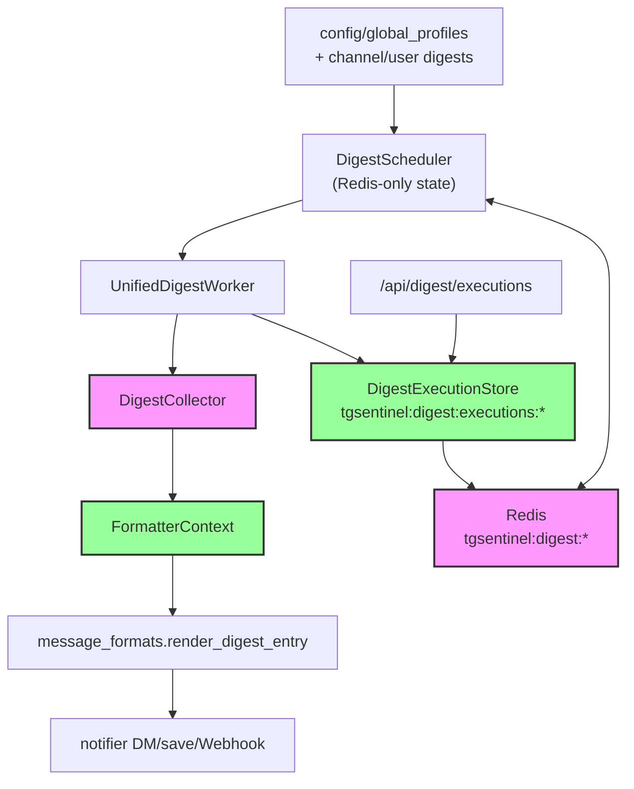

# Delivery Schedule Flow

This diagram summarizes how digest schedules are discovered, executed, and persisted for both Alerts and Interests feeds.

## Architecture

The digest scheduling system uses **Redis-only persistence** for all state management:

- **DigestScheduler**: Tracks `last_run` timestamps exclusively in Redis (no file-based state)
- **DigestExecutionStore**: Records execution history with detailed metrics (7-day TTL)
- **UnifiedDigestWorker**: Orchestrates digest generation and creates execution records

## Flow

### Key Points

- **Redis-Only Persistence**: `DigestScheduler` stores all `last_run` timestamps exclusively in Redis. The `state_file` parameter is deprecated and ignored.
- `DigestScheduler` uses profile/channel/user digests from `AppCfg` to determine which `DigestSchedule` types are enabled (e.g., hourly, daily).
- **DigestExecutionStore** (`src/tgsentinel/digest_execution.py`) tracks execution history with:
  - `DigestExecutionRecord`: profile_id, schedule_type, status, message_count, duration, error details
  - `ExecutionStatus` enum: PENDING, RUNNING, SUCCESS, FAILED, CANCELLED
  - 7-day TTL for execution records, automatic cleanup
- `UnifiedDigestWorker` polls `DigestScheduler.get_due_schedules()` every few minutes, invokes `DigestCollector` to gather new messages, creates execution records, and hands the finished digest to Telegram/webhooks.
- **FormatterContext** provides unified context building for digest entry rendering.
- Redis keys used:
  - `tgsentinel:digest:last_run:{schedule_type}` — Last run timestamps
  - `tgsentinel:digest:executions:{profile_id}` — Execution history list
  - `tgsentinel:digest:executions:latest:{profile_id}` — Latest execution record

## API Endpoints

- `GET /api/digest/executions` — List all recent executions
- `GET /api/digest/executions/{profile_id}` — Get executions for a specific profile
- `GET /api/digest/schedules` — Get all digest schedules with next run times

## Redis Key Schema

| Key Pattern                                        | Purpose                  | TTL    |
| -------------------------------------------------- | ------------------------ | ------ |
| `tgsentinel:digest:last_run:{type}`                | Last execution timestamp | None   |
| `tgsentinel:digest:executions:{profile_id}`        | Execution history list   | 7 days |
| `tgsentinel:digest:executions:latest:{profile_id}` | Latest execution record  | 7 days |
